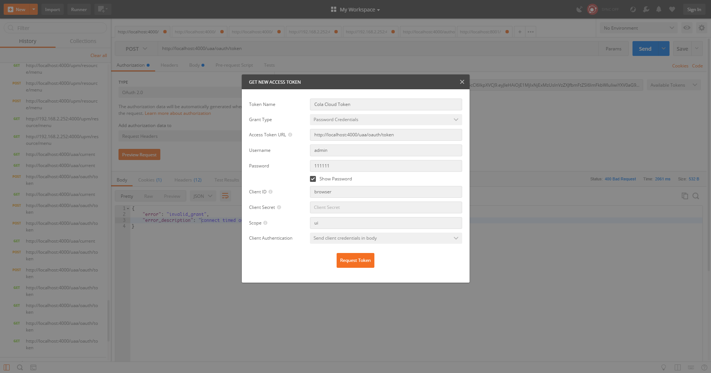
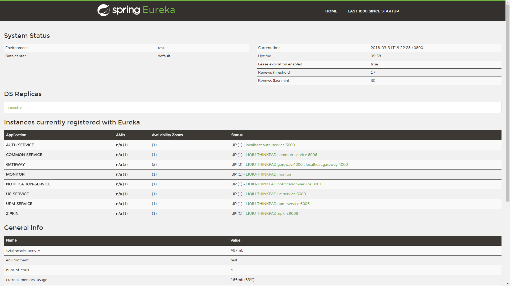
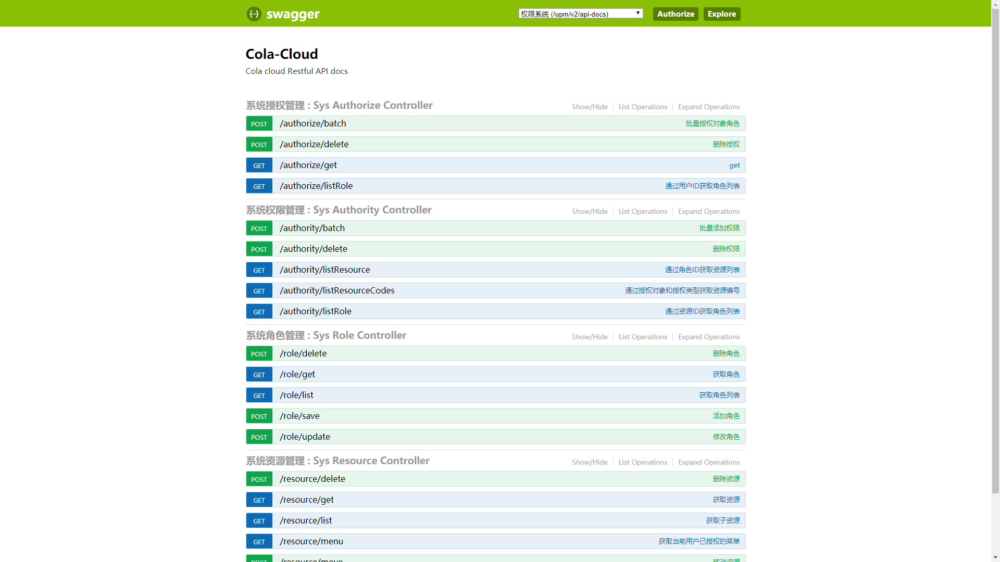
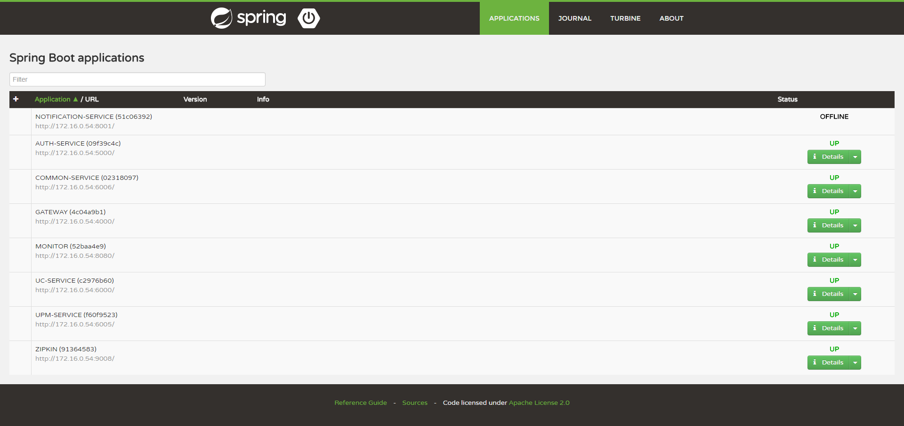
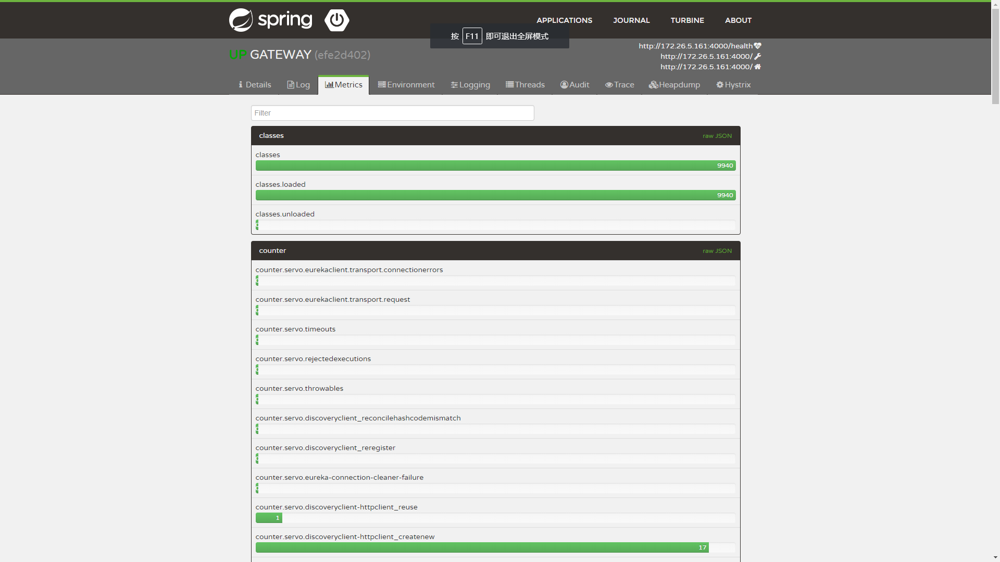
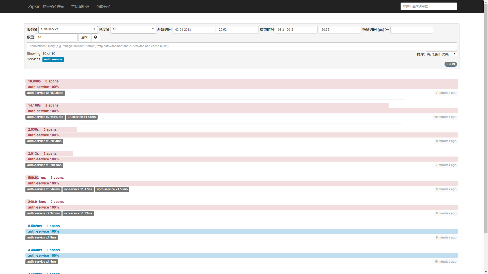
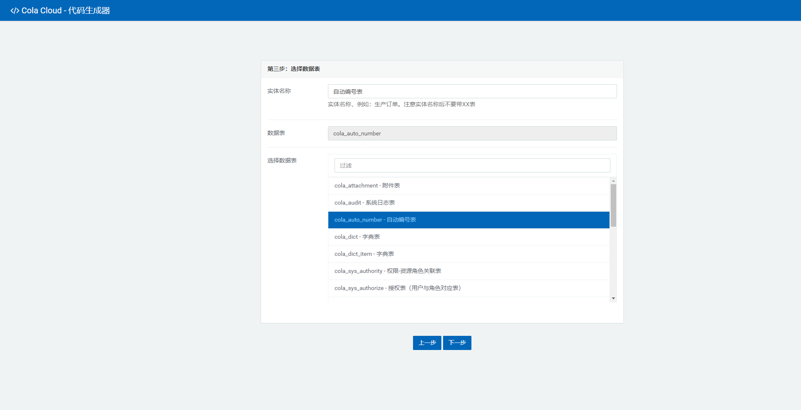

<p align="center">
 
  
  
</p>
<h2 align="center">Cola Cloud</h2>   


Cola Cloud 基于 Spring Boot, Spring Cloud 构建微服务架构企业级开发平台，集成OAuth2认证、集成短信验证码登录、FlyWay数据库版本管理、网关集成Swagger聚合所有服务API文档。基于SpringBootAdmin集成Hystrix、Turbine监控。开发用户中心、权限管理、组织架构、数据字典、消息中心、通知中心等模块。

## 服务介绍

项目名称	| 编号 | 名称	| 说明	
------------- | ------------- | ------------------------- | -------------
cola-cloud-auth	| auth-service | 认证服务	| 基于SpringSecurity进行安全认证，采用OAuth2.0认证体系，对客户端、用户进行认证及授权，支持账号密码登录，短信验证码登录	
cola-cloud-config | config	| 配置服务	| 基于Spring Cloud构建统一配置服务，负责管理所有服务的配置文件
cola-cloud-devtools | 无	| 开发工具	| Cola 代码生成器
cola-cloud-gateway | gateway	| 服务网关	| 基于Zuul构建服务网关，并对服务进行负载，前只实现静态路由
cola-cloud-monitor | monitor	| 服务监控	| 基于Spring Boot Admin集成Turbine,Hystrix，对应用状态进行监控，对服务调用进行追踪和对熔断进行监测
cola-cloud-message | message	| 通知中心	| 公共基础通知服务，支持系统消息、短信、邮件、推送通知
cola-cloud-registry | registry | 服务注册 | 基于Euraka构建服务注册中心，负责服务注册于发现
cola-cloud-common | common-service |  基础服务 | 聚合Cola平台所有公共服务
cola-cloud-organization | organization-service | 组织架构 | 提供组织架构、员工、岗位等服务
cola-cloud-tenancy | tenancy-service  | 租户服务 | 提供租户以及租户成员服务
cola-cloud-uc | uc-service  | 租户服务 | 用户中心 | 提供系统用户、用户注册服务
cola-cloud-upm | upm-service | 权限服务 | 提供角色、资源、授权服务
cola-cloud-notification | notification-service | 通知中心 | 基于RabbitMQ异步通知发送短信、邮件、WebSocket消息

## 快速启动

### 下载代码

```jshelllanguage
 git clone https://gitee.com/leecho/cola-cloud.git
```

### 配置HOST

Spring Cloud中的每个服务都是独立部署，所有在进行服务之间调用的时候需要确定对方服务的IP，为了规避IP变化带来代码修改的风险，所以需要配置host
```jshelllanguage
# 注册中心 配置中心
127.0.0.1 registry api-gateway
# reids rabbitmq mysql
127.0.0.1 cola-redis cola-rabbitmq cola-mysql
```

### 环境变量

环境变量主要是配置服务的访问用户名和密码：

```
//配置服务器用户名
CONFIG_SERVER_USERNAME
//配置服务器密码
CONFIG_SERVER_PASSWORD
//注册服务器用户名
REGISTRY_SERVER_USERNAME
//注册服务器密码
REGISTRY_SERVER_PASSWORD
//监控服务器用户名
MONITOR_SERVER_USERNAME
//监控服务器密码
MONITOR_SERVER_PASSWORD
```

### 启动服务

启动顺序如下：```registry config auth-service uc-serivce upm-service organization-service gateway monitor```

registry必须要最先启动，registry启动之后提供接口以供其他服务进行注册

config在registry之后启动，config负责提供给其他服务配置信息，如果config没有启动，其他服务则无法启动

其他service在config之后启动，如果是第一次运行项目，启动config之后先启动uc-service进行数据初始化

gateway在最后启动，如果gateway先于其他服务启动，可能无法代理到其他服务，不过会在一段时间后重新代理

monitor，在config启动之后即可启动

### 访问
```js

http://localhost:80/ 服务网关，已经聚合了所有服务的Swagger
http://localhost:8761/ 注册中心，可以查看服务注册情况
http://localhost:8080/ 监控中心，可以查看服务运行状态

```
### 获取ACCESS_TOKEN
```js
curl -X POST \
  http://localhost:4000/uaa/oauth/token \
  -H 'Cache-Control: no-cache' \
  -H 'Postman-Token: 40aa591e-8518-4c1f-9e2d-f0c0e6151a40' \
  -H 'content-type: multipart/form-data; boundary=----WebKitFormBoundary7MA4YWxkTrZu0gW' \
  -F username=admin \
  -F password=111111 \
  -F grant_type=password \
  -F scope=ui
```

## 基础服务
### 配置服务
Spring Cloud Config 负责所有服务的配置，可以使用本地文件、GIT等方式存储分发配置文件
##### 客户端配置
需要在POM中引入`spring-cloud-starter-config` 依赖, 根据约定自动状态

在项目中需要设置配置服务的信息，例如配置服务器的地址，访问的用户名和密码等信息，在resources目录下 `bootstrap.yml` 文件配置
```yml
spring:
  application:
    name: message-service
  cloud:
    config:
      uri: http://config:8888
      fail-fast: true
```

### 认证服务

Spring Security OAuth2 客户端配置
```yml
security:
  oauth2:
    client:
      clientId: server
      clientSecret: server
      accessTokenUri: http://auth-service:5000/uaa/oauth/token
      grant-type: client_credentials
      scope: server

```

``` java
@PreAuthorize("#oauth2.hasScope('server')")
@RequestMapping(value = "accounts/{name}", method = RequestMethod.GET)
public List<DataPoint> getStatisticsByAccountName(@PathVariable String name) {
	return statisticsService.findByAccountName(name);
}
```

### 服务网关

```yml
zuul:
  routes:
    message-service:
        path: /notifications/**
        serviceId: message-service
        stripPrefix: false

```


### 注册中心

``` yml
spring:
  application:
    name: message-service
```


## 配置
### 短信配置
```yml
cola:
  sms:  #短信配置
    type: aliyun
    aliyun:
      access-key-id: 
      access-key-secret: 
```

### 存储配置
```yml
cola:
  storage:
    type: aliyun
    oss:
      access-key-id: 
      access-key-secret: 
      bucket-name: 
      endpoint: 
```

## 系统截图
### 获取Token


### 注册中心


### API文档


### 监控中心


### 监控详细信息


### 链路追踪


### 代码生成器



QQ交流群：736697444